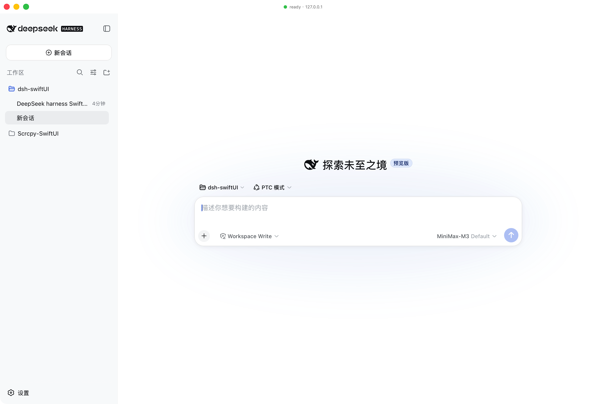

# dsh-swiftUI

A native macOS shell for the [DeepSeek Harness](https://github.com/deepseek-ai/deepseek-harness) (dsh) web UI.

`dsh` ships its product as a CLI that boots a local HTTP server and serves a SPA front-end. `dsh-swiftUI` wraps that experience in a native SwiftUI application: it owns the window, the menu, the lifecycle, and (by default) forks `dsh web` itself. The dsh SPA is rendered inside a `WKWebView`; the native side stays out of dsh's way.

> **Pure shell.** dsh-swiftUI does not modify dsh, does not bundle dsh, and does not write any dsh client plugin. It talks to dsh the same way a browser does: a single HTTP/WebSocket origin on `127.0.0.1`.

This first milestone delivers the **main panel only** — the WKWebView pointing at the dsh SPA, with a transparent titlebar and a floating status badge. The roadmap for future native panels (Git, file tree, in-process terminal) is captured in [`docs/ROADMAP.md`](docs/ROADMAP.md); that work is intentionally deferred.



---

## What works

| Stage | State |
|---|---|
| Repository skeleton + docs | ✅ |
| SwiftPM package + Xcode project (XcodeGen-generated) | ✅ |
| `DSHShellCore` framework — process manager, endpoint resolver, health/attach probes, settings store | ✅ |
| SwiftUI `DSHShell` app — `AppDelegate`-owned `AppCoordinator`, native window, `WKWebView` surface | ✅ |
| `DSHProcessManager` — fork `dsh web`, capture URL, crash-time auto-restart, **clean shutdown via `kill`/`waitpid`** | ✅ |
| `launchMode == .attach` fallback (scan loopback for an existing dsh) | ✅ |
| App icon, transparent titlebar, floating status badge | ✅ |
| Preferences (binary path, listen host/port, trusted hosts, timeouts, auto-restart) | ✅ |
| Unit tests for `DSHShellCore` | ✅ 10/10 |
| `swift build` and `xcodebuild` both clean | ✅ 0 warnings, 0 errors |
| Git / File tree / Terminal panels | ⏳ Roadmap only |

---

## Requirements

- **macOS 15+** (built and tested on macOS 27 with the Xcode-beta SDK)
- **Xcode-beta** (the bundled Swift 6.4 toolchain is the target compiler)
- A working **dsh** install — `dsh --version` should print `0.1.0-rc.6` or later.
  ```sh
  npm install -g @deepseek-ai/dsh
  ```
  The first launch needs the dsh front-end dist to be built (`pnpm run build` from the dsh repo). dsh-swiftUI does **not** ship the dsh dist.

If you have multiple Xcode versions installed, point the active developer directory at the beta once:
```sh
sudo xcode-select -s /Applications/Xcode-beta.app/Contents/Developer
```

---

## Building

### Option A — Xcode

```sh
brew install xcodegen              # one-time
./scripts/generate-xcodeproj.sh    # regenerates DSHShell.xcodeproj
open DSHShell.xcodeproj
```

Then ⌘R. The first build expects a signing identity. For a local-only build, set the team to "None" and enable "Sign to Run Locally"; the project already disables Hardened Runtime because ad-hoc-signed frameworks would otherwise fail dyld library validation (no shared Team ID).

### Option B — Swift Package

```sh
swift build -c release           # builds DSHShellCore + DSHShell
swift test                       # runs the 10 unit tests
```

To produce a `.app` bundle, use the Xcode project (Option A).

---

## Configuration

Settings live at `~/Library/Application Support/dsh-swiftUI/settings.json`. Defaults:

```json
{
  "dshBinaryPath": "/Users/djx/.npm-global/bin/dsh",
  "launchMode": "spawn",
  "listenHost": "127.0.0.1",
  "preferredPort": 0,
  "trustedHosts": ["127.0.0.1", "localhost"],
  "pollIntervalSeconds": 0.5,
  "spawnTimeoutSeconds": 30,
  "autoRestartOnCrash": true
}
```

| Field | Meaning |
|---|---|
| `dshBinaryPath` | Absolute path to the `dsh` executable. |
| `launchMode` | `spawn` → fork `dsh web` ourselves; `attach` → only connect to an already-running instance. |
| `listenHost` | Local host passed to `dsh web --host`. `0.0.0.0` is **not** supported (mirrors dsh's own policy). |
| `preferredPort` | `0` → let the OS assign; otherwise forwarded to `dsh web --port`. |
| `trustedHosts` | Hosts appended to `dsh web --trusted-host` (repeatable). |
| `spawnTimeoutSeconds` | How long to wait for the `dsh web:` URL line on stdout before failing. |
| `autoRestartOnCrash` | One-shot exponential back-off restart on unexpected child exit. |

The shell forwards no working directory to `dsh web` — the dsh SPA picks its own workspace inside the browser UI.

---

## Lifecycle

```
+-----------+   fork    +----------+    http   +-----------+
| DSHShell  | --------▶ | dsh web  | --------▶ | WKWebView |
| (macOS)   |           | (child)  |           |  + SPA    |
+-----------+           +----------+           +-----------+
       │                      │
       │  ⌘Q / terminate    │  crash
       ▼                      ▼
   kill+waitpid         respawn w/ backoff
```

- On launch the app forks `dsh web`, captures the `dsh web: http://127.0.0.1:NNNN/` line, and points the `WKWebView` at it.
- If the child crashes, the manager schedules a single automatic restart with exponential back-off (capped at 30s).
- On `applicationWillTerminate` the `AppDelegate` calls `AppCoordinator.shutdownBlocking()`: it signals the child with `SIGTERM`, escalates to `SIGKILL` after 5s, and uses `waitpid` to confirm the child has reaped before the process exits. **This is the path that prevents orphan dsh processes** — a Swift `Task` would not have run in time during runtime teardown.

---

## Diagnostics

Lifecycle events flow through `OSLog` with subsystem `ai.deepseek.dsh-shell`. To see them:

```sh
log stream --predicate 'subsystem == "ai.deepseek.dsh-shell"' --info --debug
```

Or read the last minute:

```sh
log show --predicate 'subsystem == "ai.deepseek.dsh-shell"' --last 1m --info --debug
```

If a launch fails with `EADDRINUSE`, a previous `dsh web` is still bound to a port. The error message tells you to run `pkill -f 'dsh web'`.

---

## Architecture

See [`docs/ARCHITECTURE.md`](docs/ARCHITECTURE.md) for the layered view, the dsh integration boundary, the process model, and the App Sandbox stance. The roadmap for native panels lives in [`docs/ROADMAP.md`](docs/ROADMAP.md).

---

## License

MIT. See [`LICENSE`](LICENSE).
